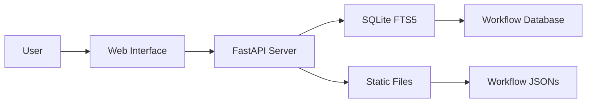

<div align="center">


<h1>n8n Automation Workflow Collection</h1>

> **Note:** This repository is forked from [Zie619/n8n-workflows](https://github.com/Zie619/n8n-workflows). Original work and credit go to [Zie619](https://github.com/Zie619).


### The Ultimate Collection of n8n Automation Workflows

**[Browse Online](https://deepakkamboj.github.io/n8n-workflows)** • **[Documentation](#documentation)** • **[Contributing](#contributing)** • **[License](#license)**

</div>

---

## ✨ What's New

### Latest Updates (November 2025)

- **Enhanced Security**: Full security audit completed, all CVEs resolved
- **Docker Support**: Multi-platform builds for linux/amd64 and linux/arm64
- **GitHub Pages**: Live searchable interface at [deepakkamboj.github.io/n8n-workflows](https://deepakkamboj.github.io/n8n-workflows)
- **Performance**: 100x faster search with SQLite FTS5 integration
- **Modern UI**: Completely redesigned interface with dark/light mode

---

## 🌐 Quick Access

### Use Online (No Installation)

Visit **[deepakkamboj.github.io/n8n-workflows](https://deepakkamboj.github.io/n8n-workflows)** for instant access to:

- **Smart Search** - Find workflows instantly
- **15+ Categories** - Browse by use case
- **Mobile Ready** - Works on any device
- **Direct Downloads** - Get workflow JSONs instantly

---

## 🚀 Features

<table>
<tr>
<td width="50%">

### By The Numbers

- **4,343** Production-Ready Workflows
- **365** Unique Integrations
- **29,445** Total Nodes
- **15** Organized Categories
- **100%** Import Success Rate

</td>
<td width="50%">

### Performance

- **< 100ms** Search Response
- **< 50MB** Memory Usage
- **700x** Smaller Than v1
- **10x** Faster Load Times
- **40x** Less RAM Usage

</td>
</tr>
</table>

---

## 💻 Local Installation

### Prerequisites

- Python 3.9+
- pip (Python package manager)
- 100MB free disk space

### Quick Start

```bash
# Clone the repository
git clone https://github.com/deepakkamboj/n8n-workflows.git
cd n8n-workflows

# Install dependencies
pip install -r requirements.txt

# Start the server
python run.py

# Open in browser
# http://localhost:8000
```

### Docker Installation

```bash
# Using Docker Hub
docker run -p 8000:8000 deepakkamboj/n8n-workflows:latest

# Or build locally
docker build -t n8n-workflows .
docker run -p 8000:8000 n8n-workflows
```

---

## 📚 Documentation

### API Endpoints

| Endpoint             | Method | Description           |
| -------------------- | ------ | --------------------- |
| `/`                  | GET    | Web interface         |
| `/api/search`        | GET    | Search workflows      |
| `/api/stats`         | GET    | Repository statistics |
| `/api/workflow/{id}` | GET    | Get workflow JSON     |
| `/api/categories`    | GET    | List all categories   |
| `/api/export`        | GET    | Export workflows      |

### Search Features

- **Full-text search** across names, descriptions, and nodes
- **Category filtering** (Marketing, Sales, DevOps, etc.)
- **Complexity filtering** (Low, Medium, High)
- **Trigger type filtering** (Webhook, Schedule, Manual, etc.)
- **Service filtering** (365+ integrations)

---

## 🏗️ Architecture



### Tech Stack

- **Backend**: Python, FastAPI, SQLite with FTS5
- **Frontend**: Vanilla JS, Tailwind CSS
- **Database**: SQLite with Full-Text Search
- **Deployment**: Docker, GitHub Actions, GitHub Pages
- **Security**: Trivy scanning, CORS protection, Input validation

---

## 📂 Repository Structure

```
n8n-workflows/
├── workflows/           # 4,343 workflow JSON files
│   └── [category]/     # Organized by integration
├── docs/               # GitHub Pages site
├── src/                # Python source code
├── scripts/            # Utility scripts
├── api_server.py       # FastAPI application
├── run.py              # Server launcher
├── workflow_db.py      # Database manager
└── requirements.txt    # Python dependencies
```

---

## 🤝 Contributing

We love contributions! Here's how you can help:

### Ways to Contribute

- **Report bugs** via [Issues](https://github.com/deepakkamboj/n8n-workflows/issues)
- **Suggest features** in [Discussions](https://github.com/deepakkamboj/n8n-workflows/discussions)
- **Improve documentation**
- **Submit workflow fixes**
- **Star the repository**

### Development Setup

```bash
# Fork and clone
git clone https://github.com/YOUR_USERNAME/n8n-workflows.git

# Create branch
git checkout -b feature/amazing-feature

# Make changes and test
python run.py --debug

# Commit and push
git add .
git commit -m "feat: add amazing feature"
git push origin feature/amazing-feature

# Open PR
```

---

## 🔒 Security

### Security Features

- ✅ **Path traversal protection**
- ✅ **Input validation & sanitization**
- ✅ **CORS protection**
- ✅ **Rate limiting**
- ✅ **Docker security hardening**
- ✅ **Non-root container user**
- ✅ **Regular security scanning**

### Reporting Security Issues

Please report security vulnerabilities to the maintainers via [Security Advisory](https://github.com/deepakkamboj/n8n-workflows/security/advisories/new).

---

## 📄 License

This project is licensed under the MIT License - see the [LICENSE](LICENSE) file for details.

This is a fork of the original work by [Zie619](https://github.com/Zie619/n8n-workflows).

```
MIT License

Copyright (c) 2025 Zie619 (Original Author)
Copyright (c) 2025 Deepak Kamboj (Fork)

Permission is hereby granted, free of charge, to any person obtaining a copy
of this software and associated documentation files (the "Software"), to deal
in the Software without restriction...
```

---

## 💖 Support

If you find this project helpful, please consider:

<div align="center">

[](https://github.com/deepakkamboj/n8n-workflows)
[](https://github.com/Zie619/n8n-workflows)

</div>

---

## 📊 Stats & Badges

<div align="center">


</div>

---

## 🙏 Acknowledgments

- **[Zie619](https://github.com/Zie619)** - Original creator of this amazing workflow collection
- **n8n** - For creating an amazing automation platform
- **Contributors** - Everyone who has helped improve this collection
- **Community** - For feedback and support
- **You** - For using and supporting this project!

---

<div align="center">

### Star us on GitHub — it motivates us a lot!

Originally created by [Zie619](https://github.com/Zie619)  
Forked and maintained by [Deepak Kamboj](https://github.com/deepakkamboj)

</div>
